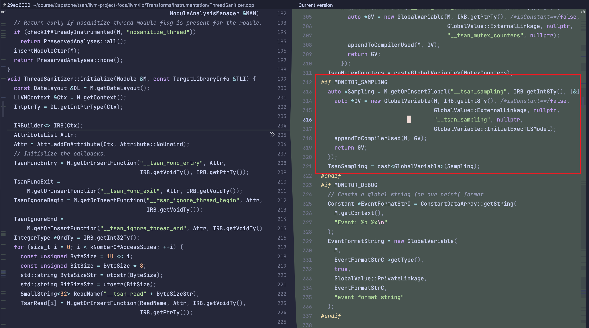
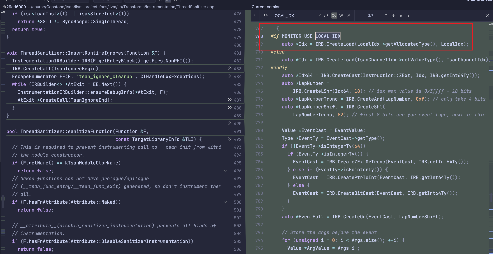
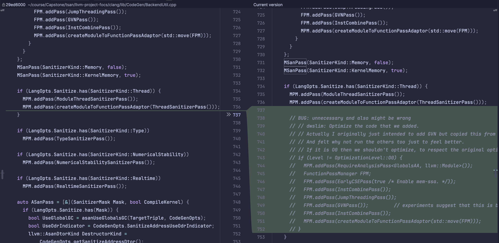
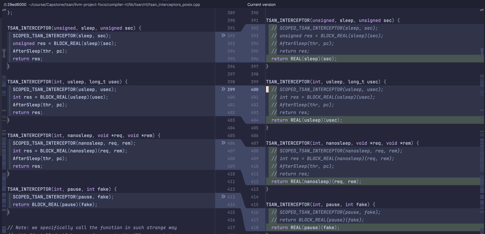
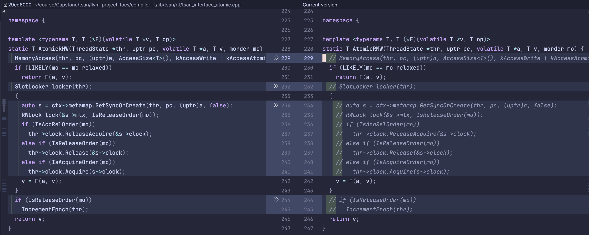
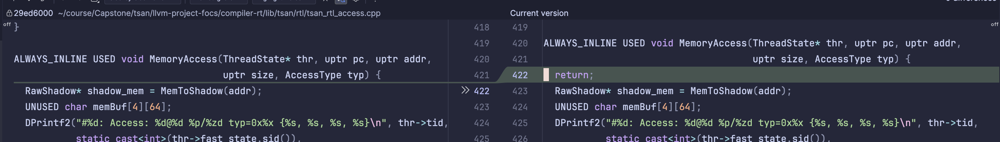

This document will briefly summarize the work done by Daniel and some information he left behind. I hope it will be helpful to you

Sampling: Daniel did some researchs about sampling in tsan, but seems like it didn't get a sound result. Moreover, it is another independent subproject about data races and does not necessarily overlap with the work I have done. Therefore, I have kept the code left by Daniel, and you can simply ignore it if you wish.

Local-index: I understand that this part was Daniel’s earlier unsuccessful attempt with channel. Initially, we did not define Channel as a TLS variable, but rather as a global Local Channel. I have kept this part, and you can simply ignore it.

Optimization after tsan: We know that in LLVM, tsan is actually a special Pass. Daniel suggested that after the ThreadSanitizerPass finishes, we could run some performance optimization Passes, similar to what is done with MSanPass, to improve our performance. However, I think this is unnecessary and may introduce other hidden issues (for example, it could change the behavior or order of MemoryAccess). Therefore, I have temporarily commented out this part of the logic.

Experiments on the performance overhead introduced by native tsan to the source program: At the beginning, Daniel and I completed this part of the work together. You can check the latest three commits in branch `benchmarkds` ([Commits · focs-lab/llvm-project · GitHub](https://github.com/focs-lab/llvm-project/commits/benchmarks/)) for details of our changes. However, I have merged these commits into my b branch, so you can also see the relevant modifications there. This part does not affect my monitor, so you can simply ignore it.

A tool: This is a benchmark tool written by Daniel [GitHub - focs-lab/tsan-benchmarks](https://github.com/focs-lab/tsan-benchmarks), but I never used this

Daniel's note:

- [Overview - HackMD](https://hackmd.io/@tsaninternals/Hy9L3J8KA/%2FWEn4z1NfQJerl0uVX9tLDg)
- [docs.google.com/document/d/1TE0nzzpA9-XE5tDVXXbIo74fkqRCJN3VhlvkUZnuExg/edit?tab=t.0#heading=h.vi1gl9x270ub](https://docs.google.com/document/d/1TE0nzzpA9-XE5tDVXXbIo74fkqRCJN3VhlvkUZnuExg/edit?tab=t.0#heading=h.vi1gl9x270ub)
